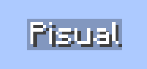

<div align="center">



## Pisual
**lightweight hologram plugin for Pumpkin MC.**


</div>

## About Pisual

**Pisual** is a hologram management plugin built with Rust for the [Pumpkin](https://github.com/Pumpkin-MC/Pumpkin) Minecraft server. It allows server administrators to easily create, configure, and manage dynamic floating text holograms in the world.

### Features
- **Multi-line Holograms**: Add, update, and remove individual lines on the fly.
- **Data Persistence**: Automatically load and save holograms to disk.
- **Billboard Orientations**: Support for fixed, vertical, and center-aligned billboard displays.


## Roadmap / TODO

- [ ] **Adding IPC**: Provide inter-process communication / plugin API for external services and integrations.
- [ ] **Internal Placeholders**: Support auto-refreshing lines and placeholder variables (e.g., player count, ping).
- [ ] **Hologram Animations**: Cycle lines, color fades, and floating movement effects.
- [ ] **Entity Icon Support**: Maybe?

## Commands
| Command | Description |
| :--- | :--- |
| `/pisual create <id>` | Create a new hologram at your position |
| `/pisual delete <id>` | Remove an existing hologram |
| `/pisual list` | List all existing holograms |
| `/pisual lines <id> <add\|set\|remove>` | Manage hologram lines |
| `/pisual teleport <id> [here]` | Teleport to a hologram or bring it to you |
| `/pisual save` / `/pisual load` | Save or reload holograms from storage |
| `/pisual help` | Display in-game help menu |


## Building

To build the plugin targeting WebAssembly for Pumpkin:

```bash
cargo build --target wasm32-wasip2 --release
```

Copy the compiled `.wasm` file from `target/wasm32-wasip2/release/` into your Pumpkin server's `plugins/` folder.
